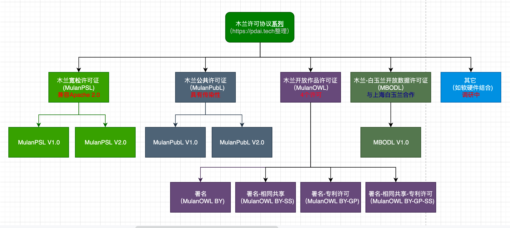
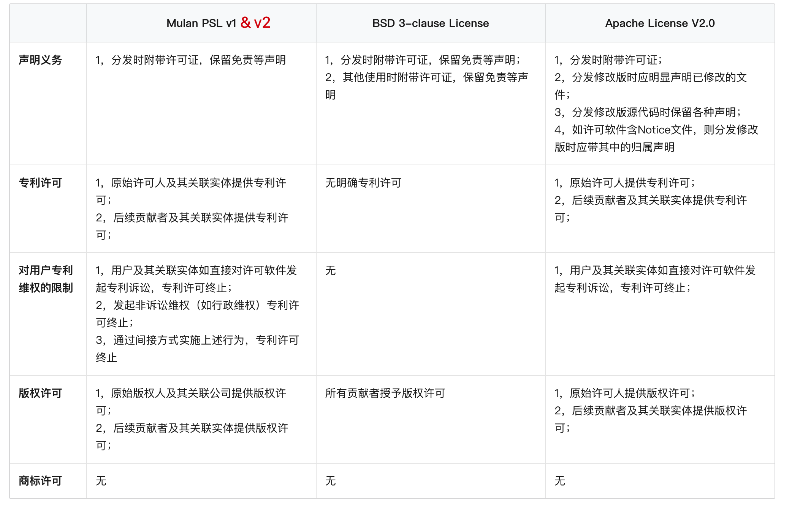
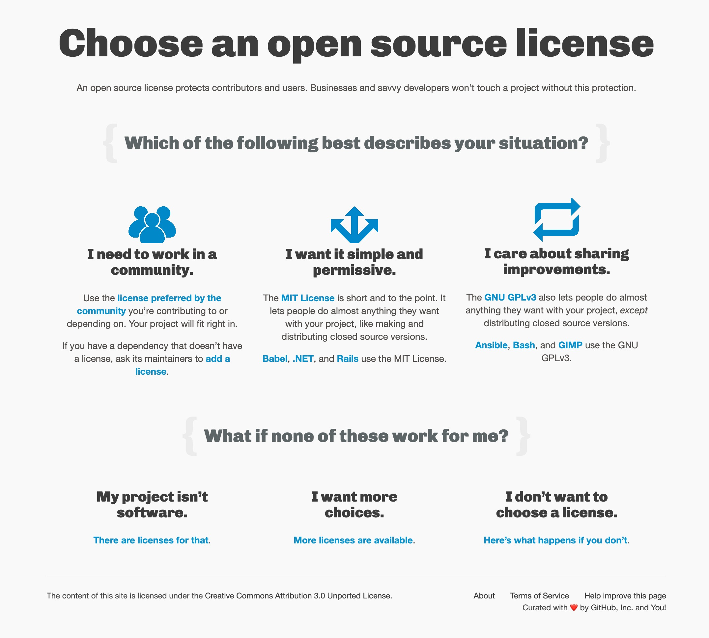
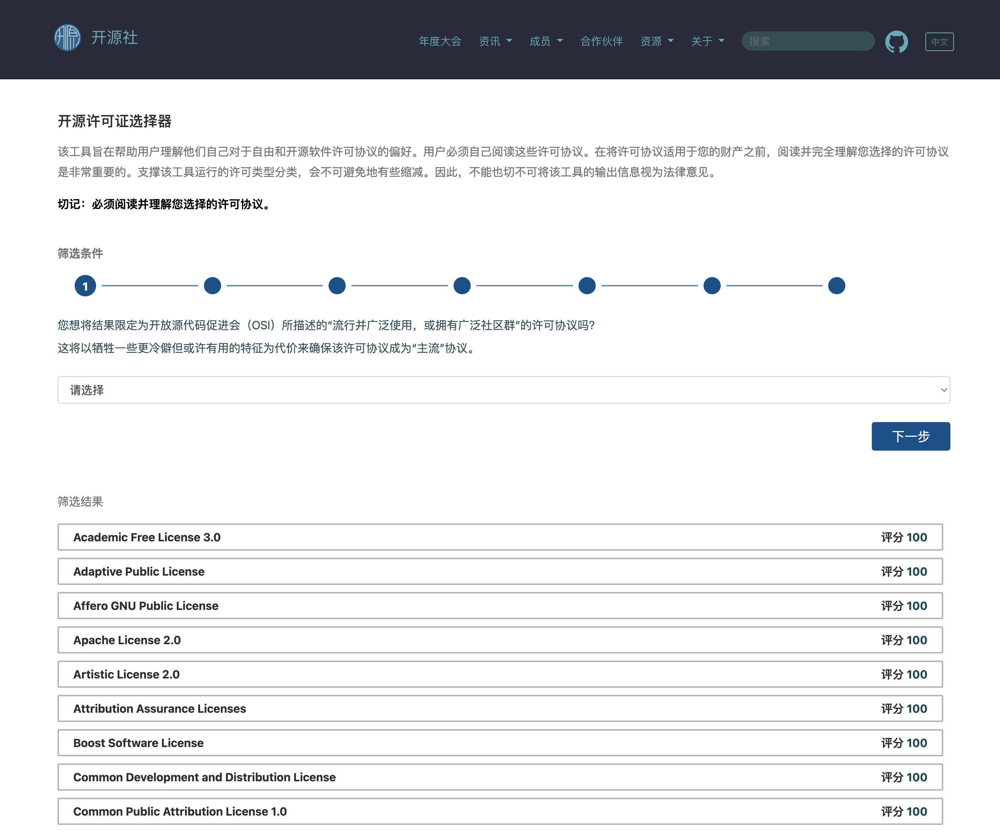

# 开源许可证（Open Source License）

首先需要明确的是，开源软件源代码的著作权既没有被放弃也没有过期，其修改和发行等仍然要受到著作权法或者开源软件许可证的制约。

我们接触到的开源软件一般都有对应的开源许可证（Open Source License）对软件的使用、复制、修改和再发布等进行限制。许可证即授权条款，开源许可证就是保证开源软件这些限制的法律文件，目的在于规范受著作权保护的软件的使用或者分发行为。**开源许可证是开源软件生态系统的基础，可以促进软件的协同开发**。

## 常见的开源许可证

常见的开源许可证主要有 **Apache、MIT、BSD、GPL、LGPL、MPL、SSPL** 等，可以大致分为两大类：**宽松自由软件许可协议（“Permissive free software licence”）和著佐权许可证（“copyleft license”）**。

- `Permissive free software licence `是一种对软件的使用、修改、传播等方式采用最低限制的自由软件许可协议条款类型。这种类型的软件许可协议将不保证原作品的派生作品会继续保持与原作品完全相同的相关限制条件，从而为原作品的自由使用、修改和传播等提供更大的空间。

- `Copyleft License` 是在有限空间内的自由使用、修改和传播，且不得违背原作品的限制条款。如果一款软件使用 Copyleft 类型许可协议规定软件不得用于商业目的，且不得闭源，那么后续的衍生子软件也必须得遵循该条款。

**两者最大的差别在于**：在软件被修改并再发行时， Copyleft License 仍然强制要求公开源代码（衍生软件需要开源），而 Permissive free software licence 不要求公开源代码（衍生软件可以变为专有软件）。

**在开源领域中，存在着两大阵营**：FSF（Free Software Foundation，自由软件基金会) 和 OSI（Open Source Initiative，开放源代码促进会），**他们对开源有着不同的理念**。

### GNU GPL（GNU General Public License，GNU通用公共许可证）

[GNU License](https://www.gnu.org/licenses/licenses.html)

我们很熟悉的Linux就是采用了GPL。GPL协议和BSD， Apache Licence等鼓励代码重用的许可很不一样。GPL的出发点是代码的开源/免费使用和引用/修改/衍生代码的开源/免费使用，但不允许修改后和衍生的代 码做为闭源的商业软件发布和销售。这也就是为什么我们能用免费的各种linux，包括商业公司的linux和linux上各种各样的由个人，组织，以及商 业软件公司开发的免费软件了。

GPL协议的主要内容是只要在一个软件中使用(”使用”指类库引用，修改后的代码或者衍生代码)GPL 协议的产品，则该软件产品必须也采用GPL协议，既必须也是开源和免费。这就是所谓的”传染性”。GPL协议的产品作为一个单独的产品使用没有任何问题， 还可以享受免费的优势。

由于GPL严格要求使用了GPL类库的软件产品必须使用GPL协议，对于使用GPL协议的开源代码，商业软件或者对代码有保密要求的部门就不适合集成/采用作为类库和二次开发的基础。

其它细节如再发布的时候需要伴随GPL协议等和BSD/Apache等类似。

###  GUN LGPL（GNU Lesser General Public License，GNU 宽通用公共许可证）

[LGPL-3.0](https://www.gnu.org/licenses/lgpl-3.0.html)

LGPL 是GPL的一个为主要为类库使用设计的开源协议。和GPL要求任何使用/修改/衍生之GPL类库的的软件必须采用GPL协议不同。LGPL 允许商业软件通过类库引用(link)方式使用LGPL类库而不需要开源商业软件的代码。这使得采用LGPL协议的开源代码可以被商业软件作为类库引用并 发布和销售。

但是如果修改LGPL协议的代码或者衍生，则所有修改的代码，涉及修改部分的额外代码和衍生的代码都必须采用LGPL协议。因 此LGPL协议的开源 代码很适合作为第三方类库被商业软件引用，但不适合希望以LGPL协议代码为基础，通过修改和衍生的方式做二次开发的商业软件采用。

GPL/LGPL都保障原作者的知识产权，避免有人利用开源代码复制并开发类似的产品。

### BSD（Berkeley Software Distribution，伯克利软件发布版）协议

BSD 协议有很多分支，它们都代表了一种宽松的自由软件协议，相对其它协议，例如GPL，来说，它们对软件的传播给予了更少的限制。 在这种协议的各种版本中，有两个版本格外的重要:  新 BSD 协议/修订版 BSD 协议和简化 BSD 协议/FreeBSD 协议。这两类协议都实现的对 GPL 兼容的自由软件协议，而且被 Open Source Initiative 认可为开源软件协议。

新 BSD 协议(3-clause license)无任何限制的允许你以任何目的二次分发这种软件，唯一的要求是必须保留拷贝权的声明和协议里的软件权利放弃条款。这种协议还有一个限制，未经许可不得使用这个作品的所有曾经捐助者的署名。 新 BSD 协议和简化 BSD 协议的最主要的区别是后者删除了署名条款。

BSD开源协议是一个给于使用者很大自由的协议。基本上使用者可以”为所欲为”，可以自由的使用，修改源代码，也可以将修改后的代码作为开源或者专有软件再发布。

但”为所欲为”的前提当你发布使用了BSD协议的代码，或则以BSD协议代码为基础做二次开发自己的产品时，需要满足三个条件:

- 如果再发布的产品中包含源代码，则在源代码中必须带有原来代码中的BSD协议。
- 如果再发布的只是二进制类库/软件，则需要在类库/软件的文档和版权声明中包含原来代码中的BSD协议。
- 不可以用开源代码的作者/机构名字和原来产品的名字做市场推广。
- BSD 代码鼓励代码共享，但需要尊重代码作者的著作权。BSD由于允许使用者修改和重新发布代码，也允许使用或在BSD代码上开发商业软件发布和销售，因此是对 商业集成很友好的协议。而很多的公司企业在选用开源产品的时候都首选BSD协议，因为可以完全控制这些第三方的代码，在必要的时候可以修改或者二次开发。

### Apache 许可证版本（Apache License Version）协议

[Apache License](https://www.apache.org/licenses/LICENSE-2.0)

Apache许可证(Apache License)，是一个在Apache软件基金会发布的自由软件许可证，最初为Apache http服务器而撰写。Apache许可证要求被授权者保留版权和放弃权利的申明，但它不是一个反版权的许可证。 此许可证最新版本为“版本2”，于2004年1月发布。 Apache许可证在Apache社区内外被广泛使用。Apache基金会下属所有项目都使用Apache许可证，许多非Apache基金会项目也使用了Apache许可证: 据统计，截至2008年4月，在sourceforge上有超过3000个项目使用了Apache许可证。

Apache 许可协议, 2.0 版本, 授予了用户大量的权利。这些权利可以应用于拷贝权，也可以用于专利权。因为很多许可协议只能适用于拷贝权，不适用于专利权，所以这个灵活性就成了让有专利的开发者们选择许可协议时的一个显著参考因素 (要想明白两者之间的不同，请参考 How Stuff Works 上的这篇文章)。

下面是关于 Apache 许可协议所允许的事项的详细说明:

- 权利永恒。 一旦被授权，权利永久不失。
- 权利无疆界。 在一个国家里被授权，形同于在所有国家被授权。例如，你在美国，但许可权最初在印度被授予，你同样可以使用这个被授权的程序。
- 授权无需付费和支付酬劳。 你既不需要在使用之前支付任何的费用，也无需在每次使用时支付任何的费用，或者其它类似情况。
- 权利不排他。 使用这种许可协议下的软件时，不妨碍你使用其它软件。
- 权利不可变更。 权利一旦授予，不可剥夺。也就是说，你在使用这个软件的过程中，你无需担心这种情况: 当你开发出了令人羡慕的基于这种授权软件的衍生产品时，有人突然跳出来对你说，抱歉，你将不再被允许使用这个程序。(在这个协议里有个条款声明: 如果你控告别人在这个许可协议下的产品有侵犯专利的行为，那你的授权将会自动终止，但这只是适用于有专利权的作品。只要你不搞有专利作品的诉讼，你永远无需担心这种问题。)
- 对再分发的作品还有个特殊要求，总的就是说要给予这些程序的作者和许可协议的维护者适当的名誉。

### MIT（Massachusetts Institute of Technology）协议

MIT 协议应该是在流行的开源协议中最简短的、使用最广泛的一种协议。它的条款非常的宽松，而且跟其它协议相比更自由。 MIT 协议是目前最少限制的协议。它基本上就是任何人可以对这个协议下的软件的做任何的事情，只要你能认可这个协议。这种协议最基本的条款 (the information that it is provided without warranty, which comprises the final paragraph) 如下:

特此授权，任何人都可免费获得这个软件以及相关文档 (the Software) 的拷贝，可以无限制的使用这个软件，包括无限制的权利去使用、复制、修改、合并、发布、附加从属协议，以及 / 或者出售软件的拷贝， 同时，为了让软件的提供者有权利做到这些，下面的条件必须遵守:

上面的拷贝权声明和许可声明必须包含在所有的这个软件拷贝里和实际分署部分里。

这也就是说:

- 你可以随意使用，复制，修改这个软件。没有人能够阻止你在任何工程里使用它，你可以复制任意次数、以任何形式，或按你的愿望修改它。
- 你可以向外免费发放，或出售。你可以随意的分发它，没有任何限制。
- 唯一的限制是你必须接受协议条款。

### 木兰系列开源许可证（Mulan）

[木兰系列开源许可证](http://license.coscl.org.cn/index.html)

北京大学作为国家重点研发计划“云计算和大数据开源社区生态系统”的子任务牵头单位，依托全国信标委云计算标准工作组和中国开源云联盟，联合国内开源生态圈产学研各界优势团队、开源社区以及拥有丰富知识产权相关经验的众多律师，在对现有主流开源协议全面分析的基础上，共同起草、修订并发布了木兰系列开源许可证。

木兰系列许可证包含“木兰宽松许可证”和“木兰公共许可证”（后续可能还有更多），均由北京大学作为牵头单位，依托全国信标委云计算标准工作组和中国开源云联盟，联合开源生态圈产学研优势团队和个体、尤其是开源法务和律师，起草、修订并发布。

目前木兰许可证族已研制发布了三个许可证：**木兰宽松许可证（MulanPSL v1；MulanPSL v2）**、木兰公共许可证（MulanPubL v1；MulanPubL v2）、**木兰-白玉兰开放数据许可协议（MBODL v1）**，分别面向开源软件宽松型、强著作权型以及开放数据集使用等三类不同的开源应用需求。同时**木兰开放作品许可证（Mulan Open Works License, Mulan OWL）**处于待发布状态，后续可能会推出更多的协议来满足特定的使用场景。

**MulanPSL v1**，具有以下特点：

- 许可证内容以**中英文双语表述**，中英文版本具有同等法律效力，方便更多的开源参与者阅读使用，**简化了中国使用者进行法律解释时的复杂度**。
- 许可证明确授予用户永久性、全球性、免费的、非独占的、不可撤销的版权和专利许可，并针对目前专利联盟存在的互诉漏洞问题，明确+ 规定禁止“贡献者”或“关联实体”直接或间接地（通过代理、专利被许可人或受让人）进行专利诉讼或其他维权行动，否则终止专利授权。
- 许可证明确不提供对“贡献者”的商品名称、商标、服务标志等的商标许可，保护“贡献者”的切身利益。
- 许可证经技术专家和法律专家共同修订，在明确合同双方行为约束的前提下尽可能地精简条款、优化表述，降低产生法律纠纷的风险。

**MulanPSL v2 对 MulanPSL v1 的具体改进**：

- 增加“语言”条款，声明了“本许可证”以中英文双语表述，中英文版本具有同等法律效力。如果中英文版本任何冲突不一致，以中文版为准。
- 为适应一些国家对担保免责条款的显著性要求，MulanPSL v2 在英文版中采用大写突显担保免责条款。
- 为了减少英文表述产生的歧义问题和语言习惯问题，MulanPSL v2 修订了“软件”（Software）和“关联实体”（Affiliates）的定义，以及“授予专利许可”（Grant of Patent License）条款的相关表述。

与主流许可证的区别

## 如何选择开源许可证

乌克兰程序员[Paul Bagwell](https://web.archive.org/web/20110503183702/http://pbagwl.com/post/5078147450/description-of-popular-software-licenses)，画了一张分析图，说明应该怎么选择。 下面是阮一峰中文翻译版本:

[choosealicense](https://choosealicense.com/)

[开源社-开源许可证选择器](https://kaiyuanshe.cn/license-tool/)

## 其他资料

[开源许可证的变迁：从 Elastic 两次变更开源协议说开去](https://www.infoq.cn/article/byjxvaqslwa96pat9efd)

[各类许可证](https://www.gnu.org/licenses/license-list.html)

[开源协议详解](https://pdai.tech/md/dev-spec/spec/dev-opensource.html)

[各种开源协议](https://opensource.org/licenses/alphabetical)

[SPDX License List](https://spdx.org/licenses/)

[国产开源：木兰许可协议系列](https://pdai.tech/md/dev-spec/opensource/dev-mulan.html)