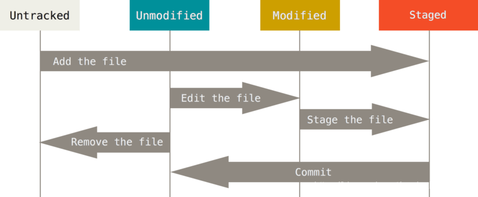

# Git 常用命令

## 名词解释

- **仓库（Repository）**
  保存了所有文件的修改历史。

- **工作区（Working Directory)**
  本地电脑上的工作目录文件夹。

- **暂存区（Staging area）**
  暂存区是暂存工作区的文件变化。

- **索引（Index）**
  索引是暂存区的另一种术语，即暂存区的别名。

- **签入（Checkin）**
  将新版本复制回仓库

- **签出（Checkout）**
  从仓库中将文件的最新修订版本复制到工作区

- **提交（Commit）**
  将暂存区的文件提交到仓库

- **冲突（Conflict）**
  多人对同一文件的同一部分进行了修改，导致了冲突的发生。

- **合并（Merge）**
  将指定分支合并到当前分支

- **分支（Branch）**
  从当前分支上分离开的副本。

- **头（HEAD）**
  指向当前选择的分支。

- **修订（Revision）**
  表示代码的一个版本状态。Git通过用SHA1 hash算法表示的ID来标识不同的版本。

- **标记（Tags）**
  标记某个分支的某一个版本，方便检索和查看。

- **推送（Push）**
  向远程仓库推送当前分支

- **拉取（Pull）**
  从远程仓库拉取文件，并合并入当前分支。
- **远程仓库(Remote)**

- 文件状态

  - **Untracked**: 未跟踪。此文件仅在工作区中，暂存区和版本库没有它，未进行版本控制。 新建或新增一个文件即产生一个未追踪文件。通过git add 将其加入暂存区，即成为已追踪文件;
  - **Unmodified**: 未修改。文件已经入库，未修改，即版本库中的文件快照内容与工作区中完全一致。 这种类型的文件有两种去处, 如果它被修改, 而变为Modified. 如果移出版本库, 则成为Untracked文件;
  - **Modified**: 已修改。已经版本控制的文件在工作区中被修改了，还未加入暂存区。 这个文件也有两个去处, 通过git add可进入暂存staged状态。使用git checkout – 命令丢弃修改, 返回到unmodify状态, git checkout –命令是用暂存区的文件覆盖工作区文件;
  - **Staged**: 已暂存。文件已经进入暂存区。执行git commit则将修改同步到库中, 这时库中的文件和本地文件又变为一致, 文件为Unmodify状态. 执行git reset HEAD filename取消暂存, 文件状态为Modified

  状态流转

  


## 命令

### 新建代码库

```shell
# 在当前目录新建一个Git代码库
git init
# 新建一个目录，将其初始化为Git代码库
git init [project-name]
# 下载一个项目和它的整个代码历史
git clone [url]
```

### 设置

Git 的设置文件为`. gitconfig`，它可以在用户主目录下 (全局配置)，也可以在项目目录下 (项目配置)

```shell
# 显示当前的Git配置
git config --list
# 编辑Git配置文件
git config -e [--global]
# 设置提交代码时的用户信息
git config [--global] user.name "[name]"
git config [--global] user.email "[email address]"
# 颜色设置
git config --global color.ui true                  # git status等命令自动着色
git config --global color.status auto
git config --global color.diff auto
git config --global color.branch auto
git config --global color.interactive auto
git config --global --unset http.proxy             # remove  proxy configuration on git
# 为 Git 命令创建全局的别名
git config --global alias.<alias> <command>
```

### 修改文件

```shell
# 添加指定文件到暂存区
git add [file1] [file2] ...
# 添加指定目录到暂存区，包括子目录
git add [dir]
# 添加当前目录的所有文件到暂存区
git add .
# 添加每个变化前，都会要求确认
# 对于同一个文件的多处变化，可以实现分次提交
git add -p
# 删除工作区文件，并且将这次删除放入暂存区
git rm [file1] [file2] ...
# 递归删除指定目录下的文件
git rm -r <directory>
# 停止追踪指定文件，但该文件会保留在工作区,不会从磁盘中删除
git rm --cached [file]
# 改名文件，并且将这个改名放入暂存区
git mv [file-original] [file-renamed]
```

### 代码提交

```shell
# 提交暂存区到仓库区
git commit -m [message]
# 提交暂存区的指定文件到仓库区
git commit [file1] [file2] ... -m [message]
# 提交工作区自上次commit之后的变化，直接到仓库区
git commit -a
# 提交时显示所有diff信息
git commit -v
# 将add和commit合为一步
git commit -am 'message'
# 使用一次新的commit，替代上一次提交
# 如果代码没有任何新变化，则用来改写上一次commit的提交信息
git commit --amend -m [message]
# 重做上一次commit，并包括指定文件的新变化
git commit --amend [file1] [file2] ...
```

### 分支

```shell
# 列出所有本地分支
git branch
# 列出所有远程分支
git branch -r
# 列出所有本地分支和远程分支
git branch -a
# 新建一个分支，但依然停留在当前分支
git branch [branch-name]
# 新建一个分支，并切换到该分支
git checkout -b [branch]
# 新建一个分支，指向指定commit
git branch [branch] [commit]
# 新建一个分支，与指定的远程分支建立追踪关系
git branch --track [branch] [remote-branch]
# 切换到指定分支，并更新工作区
git checkout [branch-name]
# 切换到上一个分支
git checkout -
# 建立追踪关系，在现有分支与指定的远程分支之间
git branch --set-upstream [branch] [remote-branch]
# 合并指定分支到当前分支
git merge [branch]
# 选择一个commit，合并进当前分支
git cherry-pick [commit]
# 删除分支
git branch -d [branch-name]
# 删除远程分支
git push origin --delete [branch-name]
git branch -dr [remote/branch]
# 检出版本v2.0
git checkout v2.0
# 从远程分支develop创建新本地分支devel并检出
git checkout -b devel origin/develop
# 检出head版本的README文件（可用于修改错误回退）
git checkout -- README 
# 合并指定分支到当前分支，只保留一个
git rebase <branch>
# 终止 rebase 操作，即回到执行 rebase 之前的状态
git rebase --abort
# 解决冲突后继续执行 rebase
git rebase --continue
```

### 标签

```shell
# 列出所有tag
git tag
# 新建一个tag在当前commit
git tag [tag]
# 新建一个tag在指定commit
git tag [tag] [commit]
# 删除本地tag
git tag -d [tag]
# 删除远程tag
git push origin :refs/tags/[tagName]
# 查看tag信息
git show [tag]
# 提交指定tag
git push [remote] [tag]
# 提交所有tag
git push [remote] --tags
# 新建一个分支，指向某个tag
git checkout -b [branch] [tag]
```

### 查看信息

```shell
# 显示有变更的文件
git status
# 显示当前分支的版本历史
git log
# 显示commit历史，以及每次commit发生变更的文件
git log --stat
# 搜索提交历史，根据关键词
git log -S [keyword]
# 显示某个commit之后的所有变动，每个commit占据一行
git log [tag] HEAD --pretty=format:%s
# 显示某个commit之后的所有变动，其"提交说明"必须符合搜索条件
git log [tag] HEAD --grep feature
# 显示某个文件的版本历史，包括文件改名
git log --follow [file]
git whatchanged [file]
# 显示指定文件相关的每一次diff
git log -p [file]
# 显示过去5次提交
git log -5 --pretty --oneline
# 显示所有提交过的用户，按提交次数排序
git shortlog -sn
# 显示指定文件是什么人在什么时间修改过
git blame [file]
# 显示暂存区和工作区的差异
git diff
# 显示暂存区和上一个commit的差异
git diff --cached [file]
# 显示工作区与当前分支最新commit之间的差异
git diff HEAD
# 显示两次提交之间的差异
git diff [first-branch]...[second-branch]
# 显示今天你写了多少行代码
git diff --shortstat "@{0 day ago}"
# 显示某次提交的元数据和内容变化
git show [commit]
# 显示某次提交发生变化的文件
git show --name-only [commit]
# 显示某次提交时，某个文件的内容
git show [commit]:[filename]
# 显示当前分支的最近几次提交
git reflog
```

### 远程

```shell
# 下载远程仓库的所有变动
git fetch [remote]
# 显示所有远程仓库
git remote -v
# 显示某个远程仓库的信息
git remote show [remote]
# 增加一个新的远程仓库，并命名
git remote add [shortname] [url]
# 取回远程仓库的变化，并与本地分支合并
git pull [remote] [branch]
# 上传本地指定分支到远程仓库
git push [remote] [branch]
# 强行推送当前分支到远程仓库，即使有冲突
git push [remote] --force
# 推送所有分支到远程仓库
git push [remote] --all
```

### 撤销

```shell
# 恢复暂存区的指定文件到工作区
git checkout [file]
# 恢复某个commit的指定文件到暂存区和工作区
git checkout [commit] [file]
# 恢复暂存区的所有文件到工作区
git checkout .
# 重置暂存区的指定文件，与上一次commit保持一致，但工作区不变
git reset [file]
# 重置暂存区与工作区，与上一次commit保持一致
git reset --hard
# 重置当前分支的指针为指定commit，同时重置暂存区，但工作区不变
git reset [commit]
# 重置当前分支的HEAD为指定commit，同时重置暂存区和工作区，与指定commit一致
git reset --hard [commit]
# 重置当前HEAD为指定commit，但保持暂存区和工作区不变
git reset --keep [commit]
# 新建一个commit，用来撤销指定commit
# 后者的所有变化都将被前者抵消，并且应用到当前分支
git revert [commit]
# 暂时将未提交的变化移除，稍后再移入
git stash
# 查看所有暂存列表
git stash list
# 把当前工作区的文件暂存到临时空间
git stash push
# 把文件从临时空间中恢复到当前工作区
git stash pop
# 清除工作目录中未跟踪的文件
git clean
# 列出哪些文件将从工作目录中删除
git clean -n
```

### 其他

```shell
# 生成一个可供发布的压缩包
git archive
# 列出 Git 环境变量
git var -l
```


## 其他资料

[git 名词解释和常用术语](https://blog.csdn.net/wadezhang2020/article/details/105322776)