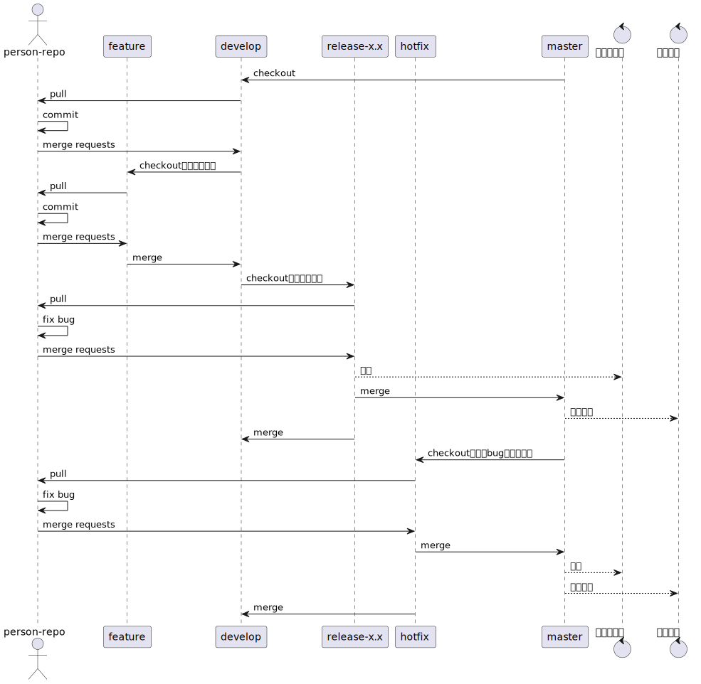
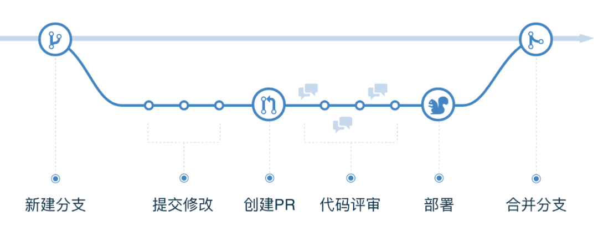
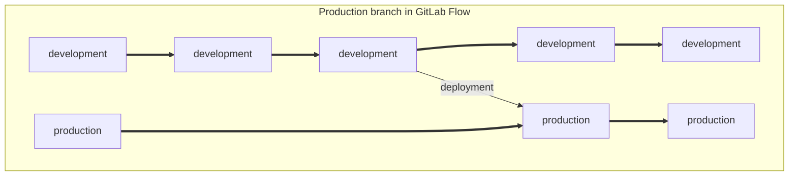
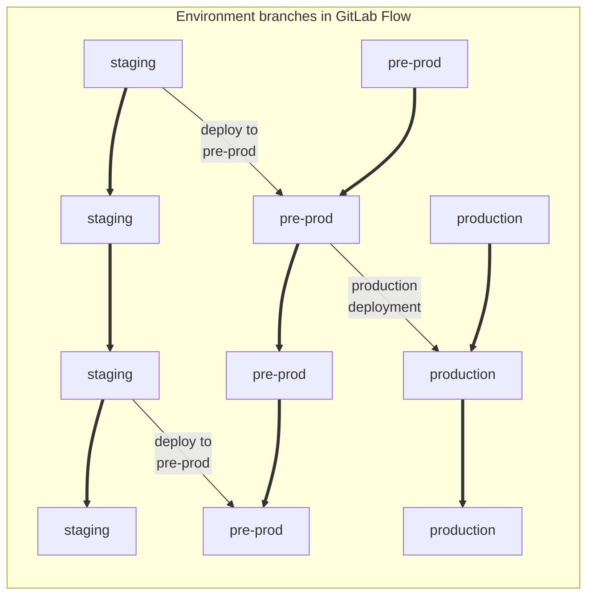
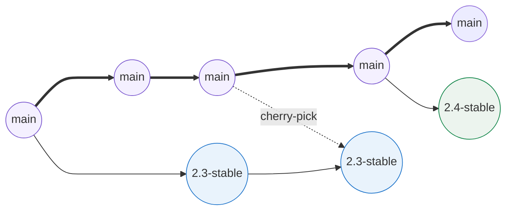
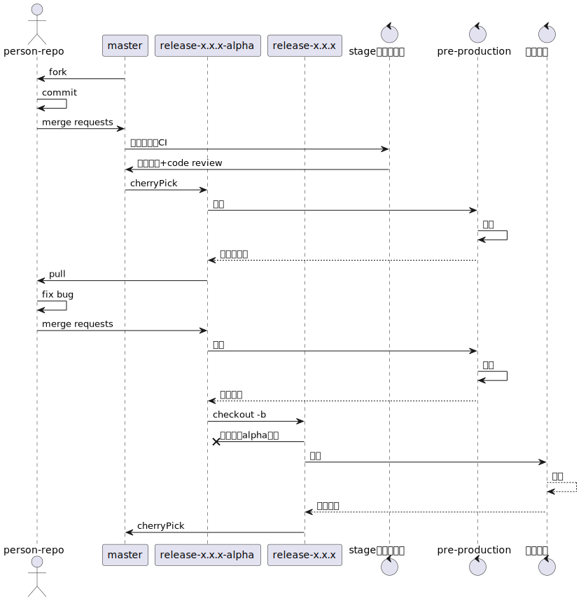
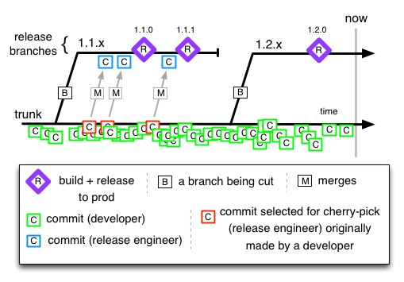
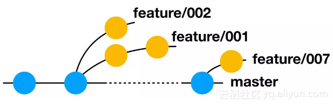
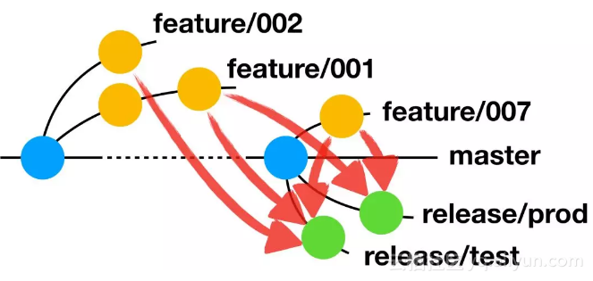
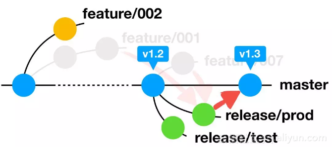

# 常见的Git 工作流

Git 提供了丰富的分支策略和工作流方式，我们在深入学习业界 Git 工作流时，每种工作流都设计的非常好，似乎都能运用到团队实践。

但在引入 Git 工作流规范开发时要留意：Git 工作流仅仅是整个研发流程中的一环。上游项目管理/缺陷追踪系统虎视眈眈，下游 CD (Continuous Delivery) 嗷嗷待哺，还得考虑团队规模、产品形态、发版方式等等因素。因此，在团队中落地 Git 工作流规范并不是一件能轻松决定的事。

Git flow、Github flow、Gitlab flow三种工作流程，有一个共同点：都采用[功能驱动式开发（Feature-driven development，简称FDD）](https://en.wikipedia.org/wiki/Feature-driven_development)。它指的是，需求是开发的起点，先有需求再有功能分支（feature branch）或者补丁分支（hotfix branch）。完成开发后，该分支就合并到主分支，然后被删除。

## Git Flow

Git工作流是最广为人知的工作流。由[Vincent Driessen](http://nvie.com/posts/a-successful-git-branching-model/) 在2010年所发明。

### 介绍

这种工作流建立在两个具有永久生命周期的分支基础之上：

- **主分支(master/main)**:

  对应生产环境的线上代码。所有开发代码都会在某个时间点合并到该分支。这个分支只能从其他分支合并，不能在这个分支直接修改。

- **开发分支(develop/dev)**

  对应的是预生产的代码。当功能分支开发完毕之后，会被合并到develop分支。包含所有要发布到下一个Release的代码，这个主要合并与其他分支，比如Feature分支。

与之并行的，是在开发周期之内，还会使用一些其他类型的分支以便支持开发流程：

- **功能分支(feature/func)**

  功能分支用来开发下次发布包含的新功能。这些分支应当都是从develop分支派生出来，然后最终也应该合并回develop分支。

- **补丁分支(hotfix)** 

  当master分支中含有不应出现的状况时，则有必要派生出hotfix分支对master分支进行紧急修复。这些分支应当派生自master 分支，并且最终应当同时合并回master 和develop 分支。

- **预发分支(release)**

  release 分支用于准备一次新的生产环境版本更新。创建release-*分支用来修复一些在测试环境未发现的小BUG，以及更新此版本的原信息。其应当派生自develop分支，并且最终同时合并回master 分支和 develop分支。

### 优势

- 在项目周期之内，该工作流保证任何时刻两个主要分支都是处于纯净状态的
- 由于遵循系统化的模式，因此分支命名容易理解
- 大多数Git工具都支持该工作流的[扩展工具](https://github.com/nvie/gitflow)
- 当项目中需要同时维护多个生产版本时，该工作流模式非常理想

### 缺陷

- Git 的历史记录将变得异常混乱，可读性很差
- master / develop 分支的割裂使CI/CD流程变得更加困难
- 当项目维护单一生产环境版本时，该工作流则不适用
- 过于繁琐，无法要求所有团队成员按照这个流程严格执行
- 违反 git 提倡的 short-lived 分支原则
- master 分支历史记录并不干净，只能通过打 Tag 标记哪些是 master 真正要部署的
- 对持续部署和 monorepo 仓库不友好

>**反思笔记（[Vincent Driessen](https://nvie.com/about/)，2020.3.5）**
> 这种模型是在 2010 年构思出来的，而现在距今已有 10 多年的历史，而 Git 本身诞生后不久。在那 10 年中，git-flow（本文介绍的分支模型）在许多软件团队中非常流行，以至于人们开始将其视为某种标准，但不幸的是，它也被当作教条或灵丹妙药。
>
> 在那 10 年中，Git 本身席卷了整个世界，并且与 Git 一起开发的最受欢迎的软件类型正越来越多地转向 Web 应用程序 —— 至少在我的过滤泡（filter bubble）中。Web 应用程序通常是连续交付的，不会回滚，并且您不必支持在市面上运行的软件的多个版本。
>
> 这不是我十年前写博客时想到的那种软件。如果您的团队正在持续交付软件，我建议您采用更简单的工作流程（例如 [GitHub flow](https://guides.github.com/introduction/flow/)），而不是尝试将 git-flow 引入您的团队。
>
> 但是，如果您正在构建明确版本控制的软件，或者如果您需要支持软件的多个版本，那么 git-flow 可能仍然适合您的团队，就像它在过去的那 10 年一样。如果是这样的话，请继续阅读。
>
> 总而言之，永远记住灵丹妙药是不存在的。考虑你自己的情况，自行决定。

## GitHub Flow

GitHub Flow 是一个基于分支的轻量级工作流，它是[GitHub 在2011年](http://scottchacon.com/2011/08/31/github-flow.html)创建。

### 介绍

其主要的流程为：

- 新建分支（Create a branch）

  根据需求，从master拉出新分支，不区分功能分支或补丁分支

- 提交修改（Add commits）

- 创建PR（Open a Pull Request）

  新分支开发完成后，或者需要讨论的时候，就向master发起一个pull request（简称PR）

- 代码评审（Discuss and review your code）

  Pull Request既是一个通知，让别人注意到你的请求，又是一种对话机制，大家一起评审和讨论你的代码。对话过程中，你还可以不断提交代码

- 部署（Deploy）

  Pull Request被接受，合并进master,重新部署

- 合并（Merge）

  原来拉出来的那个分支就被删除。（先部署再合并也可。）

该工作流遵循以下的一些原则：

- 任何时刻的master分支代码都是可以用来部署的

- 任何新变更都需要从master派生出一个分支，并且为其起一个描述新变更内容的名字：比如 new-oauth2-scopes

- 在本地提交该新分支变更，并且应经常性的向服务器端该同名分支推送变更

- 当你需要帮助、反馈，或认为新分支可以合并的时候，新建一个pull request

- 只有在其他人review通过之后，新分支才允许合并到 `master` 分支

- 一旦新分支被合并推送至`master`分支，master分支应当立即进行部署

### 优势

- 该工作流对于CI/CD流程友好
- 是Git工作流的一种简版替换
- 当项目维护单一生产环境版本时，该工作流适用

### 缺陷

- 生产环境对应的代码极易处于不稳定状态
- 对于依赖发布计划的项目无法充分支持
- 该工作流并不涉及关于部署，环境，发布和问题等方面的解决方案
- 当项目维护多生产环境版本时，该工作流不适用

## GitLab Flow

GitLab工作流由[GitLab](https://about.gitlab.com/topics/version-control/what-is-gitlab-flow/)创建于2014年。这种工作流将[功能驱动的开发模式](https://en.wikipedia.org/wiki/Feature-driven_development)与问题跟踪结合在一起。与GitHub工作流最大的不同，是GitLab工作流新创建了与环境相关的分支（比如，`staging`分支和`production`分支），适用于每次合并功能分支后不需马上部署至生产环境的项目（如SaaS软件，移动软件项目等）。

### 介绍

GitLab Flow 并不像 Git Flow, GitHub Flow 一样具有明显的规范，它更多是在 GitHub Flow 基础上，综合考虑环境部署、项目管理等问题而得出的一种实践。

Gitlab flow 的最大原则叫做**”上游优先”（upsteam first）**，即只存在一个主分支`master`，它是所有其他分支的”上游”。只有上游分支采纳的代码变化，才能应用到其他分支。

**持续发布**：

**环境发布**

**版本发布**

结合了`Git Flow`分支模型和`Github Flow`分支模型：

### 优势

- 相对于前两种工作流，GitLab工作流定义了如何进行CI和CD流程的整合
- 提交历史会非常清爽，历史信息看上去会更具可读性（参见：[为何开发人员应该使用squash and merge, 而不是仅仅merge](https://softwareengineering.stackexchange.com/questions/263164/why-squash-git-commits-for-pull-requests)）
- 当项目维护单一生产环境版本时，该工作流适用

### 缺陷

- 比GitHub工作流更加复杂
- 当项目维护多生产环境版本时，将会变得和Git Flow一样复杂

## Trunk-based Flow

**Trunk based Development(主干开发，TBD)**，是一套代码分支管理策略，开发人员之间通过约定向被指定为 **主干** 的分支提交代码，以此抵抗因为长期存在的多分支导致的开发压力。

此举可 **避免分支合并的困扰，保证随时拥有可发布的版本** 。“主干”这个词隐喻了树木生长的场景，树木最粗最长的部位是主干，分支从主干分离出来但是长度有限。

主干开发是助力实现持续集成和持续交付的关键因素。开发团队的成员一天多次地将代码提交到主干分支，满足了持续交付的必要条件。团队的工作在 24 小时内就可以被整合，这保证了代码版本随时处于可发布状态，使得持续交付成为可能。

按照官方文档描述：「你可以选择直接向主干分支提交代码的方式（适用于小团队）或者采用 Pull-Request 的方式，只要保证特性分支不能长期存在，并且产品是独立存在的。（the product of a single person.）」，

trunk 分支提交是比较随意的（不一定可部署），但也需要走 CR，可以采用 Fast-forward 形式的 merge 保证主干是一条线，到了合适的时间点，checkout release-* 分支，执行正式上线操作。

一旦发现 release 分支有 hotfix 需求，则先在 trunk 分支上进行 fix 开发，测试完成后，cherry-pick 到 release-* 分支，确保修复代码即在 release-* 中上线，又能被下一个 release 周期包含。

TrunkBased 模式缺点比较明显，太多的团队同时工作在主干上，到发布的时候就可能出现灾难（尤其是多版本并行开发的情况）。弥补的措施是 FeatureToggle 以及频繁的集成和足够的测试覆盖，这对开发团队的能力提出了比较高的要求。目前 TrunkBased 模式主要用在不需要同时维护多个历史版本的 SaaS 型项目，特别是经过微服务改造的各种小型服务上。

## Aone Flow

在 AoneFlow 上你能看到许多其他分支模式的影子。它基本上兼顾了 TrunkBased 的“易于持续集成”和 GitFlow 的“易于管理需求”特点，同时规避掉 GitFlow 的那些繁文缛节。

AoneFlow 只使用三种分支类型：**主干分支、特性分支、发布分支**，以及三条基本规则。

- **主干分支(master/main)**

  代表当前项目的基线，不允许直接修改。各分支功能在验证通过并发布到生产验证后，将分支集成后 release 合并回 master，保证 master 代码最新；若某个 feature 功能验证不通过，可以单独撤下该 feature 的集成再合并回 master，从而实现风险的全局最小影响。

- **发布分支(release)**

  该分支主要用于集成和发布，即在环境中（如日常、预发和生产）对各 feature 分支进行集成和部署，不同的环境下可以使用不同的 release 分支（如 release_daily、release_pre 和 release_prod）对 feature 进行集成（即 n * release ）。

- **特性分支(feature)**

  该分支为变更分支或者特性分支，用于承载具体的功能开发与缺陷修复，基于最新的 master 拉出。${specific_feature} 为具体开发的功能目标，每发起一个变更（特性开发或缺陷修复），都需要创建一个 feature 与变更进行对应，一般的开发工作都会在此分支上进行。

**规则一，开始工作前，从主干创建特性分支。**

AoneFlow 的特性分支基本借鉴 GitFlow，没有什么特别之处。每当开始一件新的工作项（比如新的功能或是待解决的问题）的时候，从代表最新已发布版本的主干上创建一个通常以feature/前缀命名的特性分支，然后在这个分支上提交代码修改。也就是说，每个工作项（可以是一个人完成，或是多个人协作完成）对应一个特性分支，所有的修改都不允许直接提交到主干。

**规则二，通过合并特性分支，形成发布分支。**

AoneFlow 的发布分支设计十分巧妙，可谓整个体系的精髓。GitFlow 先将已经完成的特性分支合并回公共主线（即开发分支），然后从公共主线拉出发布分支。TrunkBased 同样是等所有需要的特性都在主干分支上开发完成，然后从主干分支的特定位置拉出发布分支。而 AoneFlow 的思路是，从主干上拉出一条新分支，将所有本次要集成或发布的特性分支依次合并过去，从而得到发布分支。发布分支通常以release/前缀命名。

**规则三，发布到线上正式环境后，合并相应的发布分支到主干，在主干添加标签，同时删除该发布分支关联的特性分支。**

当一条发布分支上的流水线完成了一次线上正式环境的部署，就意味着相应的功能真正的发布了，此时应该将这条发布分支合并到主干。为了避免在代码仓库里堆积大量历史上的特性分支，还应该清理掉已经上线部分特性分支。与 GitFlow 相似，主干分支上的最新版本始终与线上版本一致，如果要回溯历史版本，只需在主干分支上找到相应的版本标签即可。

## 其他资料

[GitHub Flow](https://guides.github.com/introduction/flow/)

[GitLab Flow](https://docs.gitlab.com/ee/topics/gitlab_flow.html)

[主干开发](https://cn.trunkbaseddevelopment.com/)

[字节研发设施下的 Git 工作流](https://juejin.cn/post/6875874533228838925)

[了解 5 个 Git 工作流程，让我们交付更好的代码并改善开发流程 ](https://www.haoyizebo.com/posts/ffa5b4ca/)

[真正的敏捷工作流 —— GitHub flow](https://insights.thoughtworks.cn/real-agile-workflow-github-flow/)

[代码版本管理规范](https://shikanon.github.io/2020/%E7%AE%A1%E7%90%86/%E4%BB%A3%E7%A0%81%E7%89%88%E6%9C%AC%E7%AE%A1%E7%90%86%E8%A7%84%E8%8C%83/)

[What is Trunk-Based Development](https://paulhammant.com/2013/04/05/what-is-trunk-based-development/)

[在阿里，我们如何管理代码分支？](https://developer.aliyun.com/article/573549)